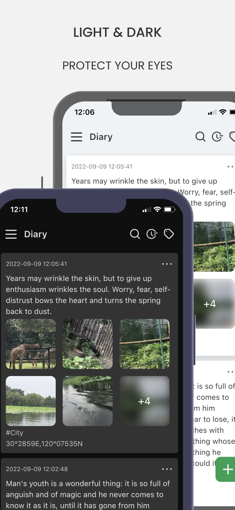
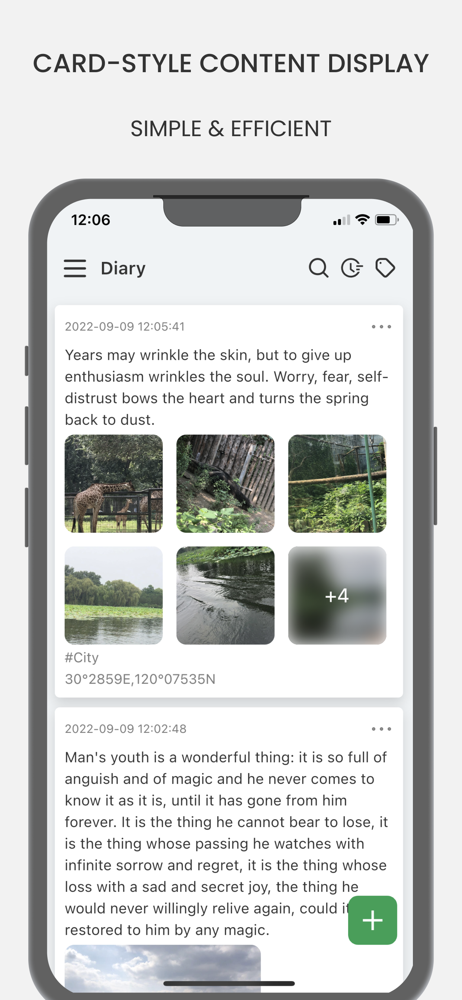
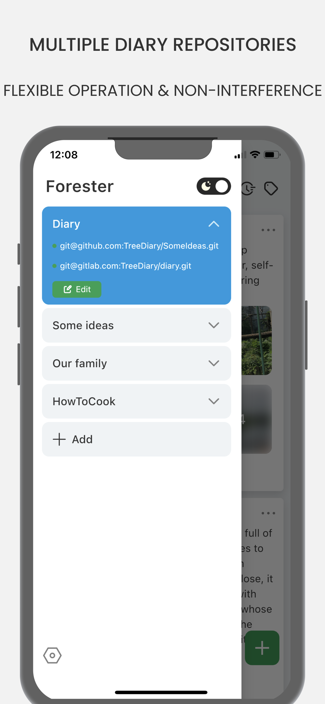
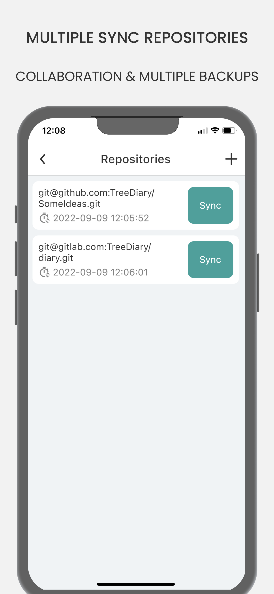
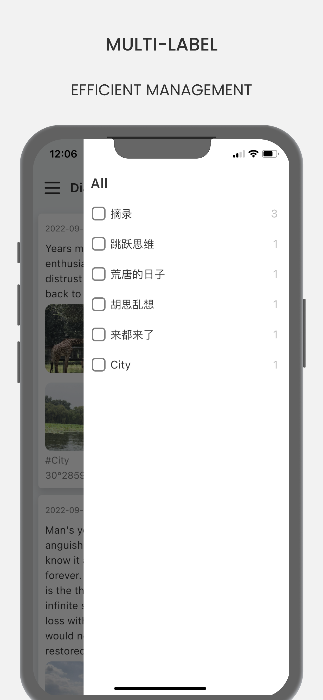
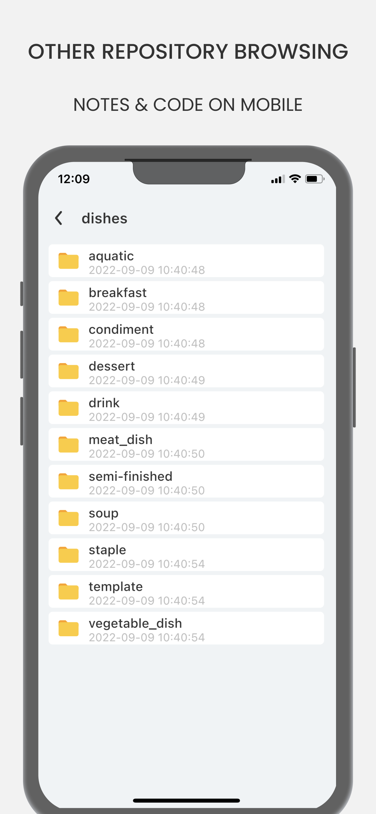

# TreeDiary
[中文](./README_ZH.md)

UI:[https://www.figma.com/community/file/1193903864336008461](https://www.figma.com/community/file/1193903864336008461)

iOS:[AppStore](https://apps.apple.com/cn/app/%E5%A4%A7%E6%A0%91%E6%97%A5%E8%AE%B0-%E6%97%A5%E8%AE%B0-%E7%AC%94%E8%AE%B0-%E6%95%B0%E6%8D%AE%E6%B0%B8%E4%B8%8D%E4%B8%A2%E5%A4%B1/id1643140633?platform=iphone)

Android:[Google Play](https://play.google.com/store/apps/details?id=com.kingtu.treediary)

# Info
- Card-type diary, similar to private Twitter, with tags, search and time filtering, can be easily reviewed at any time.

- Support multi-user to write a diary, suitable for family diary, diary of lovers, husband and wife to the baby record, etc.

- Free to choose the Git service provider of data synchronization backup (most of them are free, and some provide unlimited storage space, of course, you can also set up Git service), support Github, Gitlab automatic operation, simple operation.

- Distributed synchronous backup, a diary repository can set multiple Git service providers for backup and synchronization, do not worry about the web disk close and the server shut down.

- The diary data will be directly saved in the general Markdown format. Frequent format conversions and export backups are not required. The data can be read and written forever, and there is no need to worry that the App will disappear one day. It is suitable for ultra-long time records.

- Support browsing non-diary repositories, such as note repositories created by Obsidian, Typora, etc.

# Git&Markdown
The security and privacy of your data is the most important thing for TreeDiary.
So I introduced Git, which is a distributed version control system used by almost every programmer.  A piece of data, can be specified to store in multiple places, and maintain real-time synchronization of data; With Markdown format, data can still be read and written even without the App, without manual export and backup. 
Git carries the gene of multi-person collaboration, and it is also very convenient and easy for multiple people to write a diary together, suitable for family diary, couple diary, baby diary, etc.
You can back up your data in one or more places, synchronize it to your computer, Github, Gitlab, or other service providers at any time, or set up Git services for data synchronization using open source systems.

# Screenshot
|     |   |   |
|  ----  | ----  | ----  |
|   |  |  |
|   |  |  |

