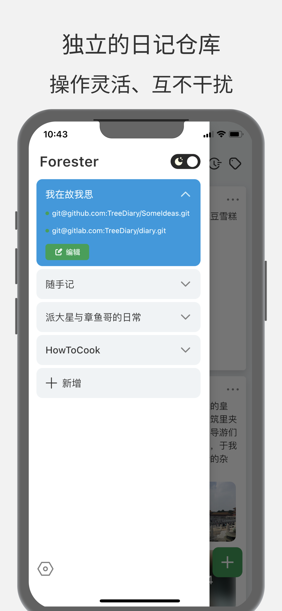
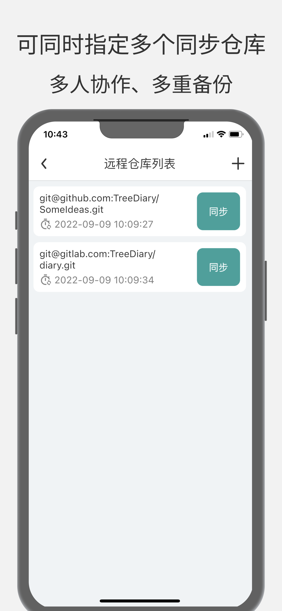
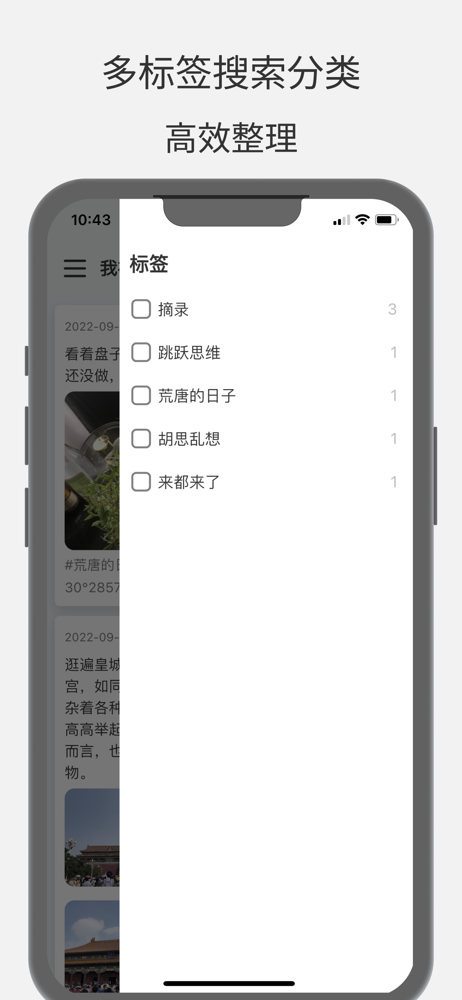
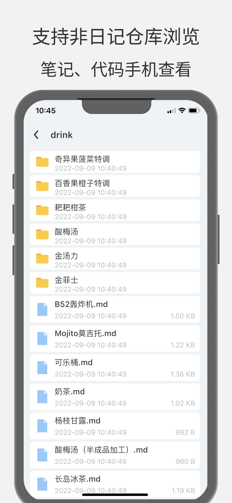

# TreeDiary
[English](./README.md)

设计稿:[https://www.figma.com/community/file/1193903864336008461](https://www.figma.com/community/file/1193903864336008461)

# 下载地址
iOS:[AppStore](https://apps.apple.com/cn/app/%E5%A4%A7%E6%A0%91%E6%97%A5%E8%AE%B0-%E6%97%A5%E8%AE%B0-%E7%AC%94%E8%AE%B0-%E6%95%B0%E6%8D%AE%E6%B0%B8%E4%B8%8D%E4%B8%A2%E5%A4%B1/id1643140633?platform=iphone)

Android:[Google Play](https://play.google.com/store/apps/details?id=com.kingtu.treediary)

# Info
0、纯Flutter开发

1、卡片式日记，类似于私人朋友圈，配合标签、搜索与时间过滤，可随时方便的回顾查看；

2、支持多人共写一本日记，适合家庭日记、情侣日记、夫妻给宝宝的记录等，甚至可以创建公开的日记本仓库；

3、可自由选择数据同步备份的Git服务商(大部分都是免费的，且有的提供无限存储空间，当然您也可自己搭建Git服务)，支持Github、Gitlab的自动操作，操作简单；

4、分布式同步备份，一个日记仓库可同时选择多个Git服务商进行备份同步，完全不用担心网盘跑路，服务器关闭这种情况；

5、日记数据会直接保存为通用的Markdown格式，无需频繁的格式转换与导出备份，数据永远可读可写，适合超长时间的记录；

6、支持非日记仓库的查看与展示，比如Obsidian、Typora等创建的笔记仓库；

# Git&Markdown说明
于大树日记而言，您的数据安全与隐私是最重要的事。
所以我引入了Git，这是一款几乎每个程序员都会用到的分布式版本控制系统，取并简化其一成功能，正好可用于数据的分布式备份，一份数据，可指定存储在多个地方，且保持数据的实时同步，用法得当，可保数据永不丢失；配合Markdown格式，即便是脱离本App，数据依旧可读可写，并无需手动导出备份；加之Git天生的多人协作基因，多人共写一个日记本也是极为方便简单，适合家庭日记、情侣日记、宝宝日记等。
您可以自主将您的数据备份在一个或者多个地方，亦可随时同步到您的电脑，Github、Gitlab或者其他服务提供商，当然您也可以使用开源的系统自己搭建Git服务用于数据的同步。

# Screenshot
|     |   |   |
|  ----  | ----  | ----  |
|   |  |  |
|   |  |  |

